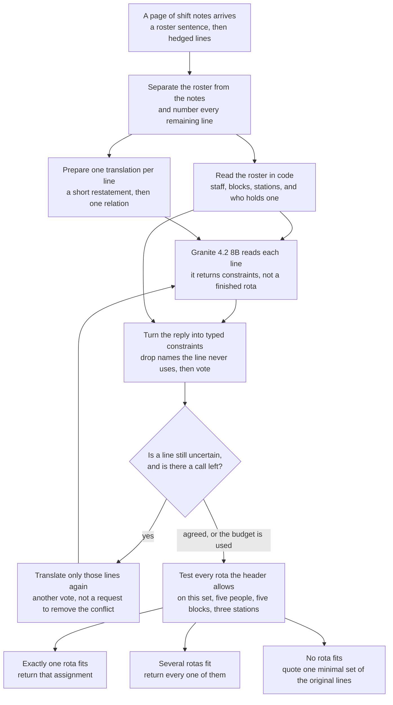

# Architecture Under a Fixed, Weak Model

## Writeup

The model is `ibm-granite/granite-4.2-8b`, temperature 1.0, top_p 0.95, reasoning off. Two probes asked it for the finished JSON before any of this was built. One ran out of tokens in prose. The other emitted JSON with two people on one station and a station on someone the header left off a station. It can format. It does not search a rota.

Asked only to label each numbered line, with a one-phrase restatement, one worked example and `json_object` output, it got about 95% of lines right and did not invent constraints out of filler. What it still got wrong was stable: a line dropped to `none`, an adjacency read backwards, a station name in a person slot, and "later than whoever has station S" given the wrong type. Extraction is therefore model-based. The case, the assignments and the minimal conflicting set are symbolic.

Each line is one of eight relations: on or off a block, on or off a station, earlier than, on touching blocks, between two people, or earlier or later than whoever holds a named station. Anything else is `none`. The model returns a line number and strings from the header. Citations are the original lines, looked up by number.

The solver enumerates every assignment the header allows. On this set that is five people, five blocks and three stations, so 5! × 3! = 720. No solution: the minimal conflicting set whose lines the samples agreed on most, then the smallest. One solution: `unique`. Two or more: `ambiguous`, every solution written out. A constraint the header already makes impossible is dropped when validation is on.

Extra budget is more translations, not a request to make the page consistent. At 3×, two full-page reads, then one read of only the lines still in dispute. At 10×, four full-page reads and up to six of those short reads. The short read is another vote. A tie drops the line, which under-constrains the rota and tends to come out `ambiguous`.

The gloss is that restatement, before the type, in the same call. The few-shot is one page I wrote (Alice through Eve, a station called dispatch that this set does not use). It does not copy the visible lines. `json_object`, with a parser that keeps finished objects from a cut-off reply, is there because an array-only prompt once collapsed into comments. Validation requires every name in a constraint to occur on that line, and substitutes when the line names exactly one and the model named another. Deduping collapses two copies of the same sentence under a lead-in that names nobody.

A regex over the visible phrasing, plus this solver, scores 1.0. `run` does not import it. The solver and the citation format are enough when the translation is perfect, so the score is extraction error.

Macro exact match. Two 1× runs of this prompt: 0.817 and 0.800. Two 3× runs: 0.950 and 0.917. One 10× run: 0.950, the same three misses as the first 3× run, and it stopped at 5 or 6 calls. On the 1× logs, 1116/1137 and 1115/1137 body lines matched the phrasing checker in `tests/oracle.py`. That checker is not the answer key, and the count is not the score. It is also later than the labelling probe above, which was about 95% of lines before this checker. On the 0.950 runs the case matrix is diagonal: the unique miss has two blocks swapped, and the inconsistent misses cite a non-minimal set. `inconsistent_label_only` 0.10 is the fraction of inconsistent items where the kind was right and the citation was not. The second 3× run adds two unique items, one called inconsistent and one called ambiguous. At 1× the off-diagonal misses are unique items called ambiguous. An end-to-end baseline scores 0.000 at 1×, 3× and 10×, one run each.

1× run 1 was an earlier prompt, not the submitted system. It scored 0.833 and called an inconsistent item unique. This prompt is a little worse at 1×, cleaner on the case matrix, and is what 3× and 10× use. `holder_before` / `holder_after` were dropped after the model wrote a correct gloss and the opposite label. It now emits `holder_order` with `person_is`, and the gloss wins when they disagree. Letting an isolated re-read outvote the page was not shipped: on the disagreements in the 10× log the page was right 23 times and the re-read 8, usually by the re-read dropping a real constraint.

Gloss off scored 0.683 at 1× and 0.733 at 3×. Few-shot off scored 0.533 and 0.633. Those two carry the system; the rest of the table is in `ABLATION.md`. Ten page-votes and no isolated read scored 0.917 and kept both bad cores. One page-read plus isolated reads, cap 10, stopped by call 4 and scored 0.933: those cores disappeared, and a real inconsistency was called unique. Deduping changed nothing. `json_object` off scored as high or higher (0.867, 0.933) and stays, because it was added for replies that do not parse.

The three errors that voting does not fix are the model agreeing with itself:

- B2-002. "Nadia then Priya, back to back" was glossed as "Priya then Nadia" on 3 of 4 reads, and the fields followed. The answer is unique and swaps those two blocks.
- B2-012. "Nadia hands straight over to Priya" was read backwards on 4 of 4 page reads. The one isolated read got it right and lost the vote. The solver then cites a conflict of size 2. Every real core here has at least 3 lines.
- B2-023. The middle of a between-line was swapped on the page and corrected once in isolation, again outvoted. The citation has 6 lines.

The 10× run stops when the samples agree. They agree on the wrong direction. A phrase list for "A then B" was not added. It would be symbolic extraction tuned to this template.

The solver never sees English, only typed tuples. The few-shot teaches the eight relations with sentences I wrote, and the header regex falls back to the model's roster from the same call, so a changed header template does not cost a second call. What will not survive is a construction this model misreads the way it misreads "A then B". Grounding only checks that the names occur on the line, and a vote among copies of one mistake stays wrong. A new idiom fails item by item, not because the solver is fitted to this generator.

With a month I would not add a phrase list. On lines where every sample agrees and the gloss has swapped the two names, I would ask a different question: which of the two names, in the order written, is earlier. More copies of the same read are what the 10× plateau already showed do not help.

Hedges keep their force. Wishes, refused requests, past arrangements and open questions do not: the model emits `none`. Treating them as negations pulls them into cores the key does not recognise. A timeout is counted as a call, because the proxy may have seen it; only a connection that never opened is retried for free. An HTTP 429 or 5xx spends a call and is retried only if budget remains, so 1× does not retry past its one call. Vote and repair cannot fire at 1×.

Not done: a third 1× run and a second full 10× run. The 1× pair sits in a 0.017 band and the 3× pair in a 0.033 band. The 10× run had already stopped by call 6 on the first 3× run's three items, so a repeat of that policy was not the next experiment.

## Reference

# Architecture Under a Fixed, Weak Model

The model is `ibm-granite/granite-4.2-8b`. It translates each line of a shift-notes page into a typed constraint. A deterministic solver then enumerates the rota, decides whether the notes are unique, ambiguous, or inconsistent, and writes the exact JSON. The model is used where the work is reading a sentence. The code is used where the work is checking every legal assignment.

> **Visible-set result:** macro exact match **0.817** and **0.800** at 1× (two runs), against **0.000** for a naive baseline that asks the same model to emit the finished JSON (one run at each budget). At 3× the full system scored **0.950** and **0.917**. The one 10× run scored **0.950** and had already stopped by call 6.

The brief reports 0.0% for this model with no harness (three one-shot runs) and 67.5% for Claude Sonnet 5 (two earlier one-shot runs). Those are the brief’s figures. The 0.000 row below is our own prompted baseline, measured separately.

Sampling is temperature 1.0, top_p 0.95, reasoning off, on every call.

## Executive summary

Each item is a page of shift notes. Exactly one assignment fits, several do, or the notes contradict themselves, and the answer has to be exact: the assignment, every consistent assignment, or a minimal set of conflicting lines.

Granite 4.2 8B can format JSON. Asked to finish the rota, it scored 0.000. Asked only to label lines, it was mostly right and failed in stable ways: a dropped line, a reversed order, a station written into a person slot.

The architecture follows that split. Constraint extraction is model-based. The case, the assignments, and the minimal conflicting set are symbolic. On the visible set the curve rises from about 0.81 at one call to 0.95 at three, then stays there at ten. The misses that remain are lines the model reads the same wrong way on every sample.

## The problem

An item is one of three kinds, equally common, and the system is not told which:

- **Unique.** Exactly one assignment is consistent with the notes. The answer is that assignment.
- **Ambiguous.** More than one assignment is consistent, between two and four. Every one must be returned. Order does not matter. Count does.
- **Inconsistent.** No assignment is consistent. The answer cites statements that cannot all hold at once, such that dropping any one of them leaves a set that can. Quoting every line fails. Quoting one line short fails. On this set every such set has at least three statements. Each citation is the original line, in full.

Every person on the rota is named. `"station"` is given only for the people the header puts on a station. Names, blocks, and stations must match the notes exactly.

There is no partial credit. A right kind with the wrong assignment, a missing alternative, or a non-minimal citation scores zero. The model cannot stop at a case label. The content for that case has to be right.

Hedges carry full force. “I’m fairly sure Priya is on calibration” states that Priya is on calibration. Wishes, refused requests, past arrangements, and open questions do not: they are not constraints on the current rota.

## Why the naive weak model fails

`wsolver/naive.py` asks the model for the finished JSON and, when the budget allows, majority-votes independent samples of that same answer. Nothing is solved symbolically.

Two probes, run before this pipeline existed, showed the failure directly. One ran out of tokens in prose. The other emitted JSON with two people on one station and a station on someone the header left off a station. It can format. It does not search a rota.

The scored baseline is the same idea, with the required sampling settings:

| Budget | Calls used | Macro exact match |
| --- | --- | ---: |
| 1× | 1 per item | 0.000 |
| 3× | up to 3, voted | 0.000 |
| 10× | 10 per item, voted | 0.000 |

One run each. Some items were declared inconsistent (`inconsistent_label_only` 0.20 at 1× and 0.10 at 3× and 10×, each a fraction of the inconsistent items), and the citations still failed the minimal-conflict rule, so the exact-match rate stayed zero. Extra samples of a wrong rota do not become a search.

## Model characterisation

The design followed a narrower probe: label each numbered line, with a one-phrase restatement, one worked example, and `json_object` output. The model got about 95% of lines right and did not invent constraints out of filler. The errors that remained were stable.

The submitted 1× logs, after the prompt and the checker, are tighter: **1116/1137** and **1115/1137** body lines matched the phrasing checker in `tests/oracle.py`, which is fitted to the visible wording and is not the answer key. The about 95% figure above is the earlier labelling probe, before that checker. Neither number is the item score. Item-level exact match is much lower, because one wrong line changes the rota or the citation.

| Observed weakness | Evidence | Architectural response |
| --- | --- | --- |
| Does not search the rota | Probes above; naive arm 0.000 at 1×, 3×, and 10× | Exhaustive solver. The model never emits an assignment |
| Drops a real line to `none`, reads an adjacency backwards, puts a station name in a person slot, mistypes “later than whoever has station S” | Stable errors on the labelling probe; still the residual misses in the 1× logs | Eight typed relations, a gloss written before the label, and a checker that rejects entities the line does not name |
| Agrees with itself when the reading is wrong | B2-002, B2-012, and B2-023 survive every extra sample. On disagreements in the 10× log the page was right 23 times and the isolated re-read 8 | Majority vote. A single re-read is another vote, and it does not replace a page the samples already agreed on |
| Replies that do not parse, or that stop mid-JSON | An array-only prompt once collapsed into comments | `json_object` output, plus a parser that keeps finished objects from a cut-off reply |

## Architecture



The file names for these steps are in the table below.

| Component | Role | Why it exists |
| --- | --- | --- |
| `client.py` | One OpenAI-compatible client per item. Temperature 1.0, top_p 0.95, reasoning off, `X-Item-Id` on every call, hard cap at the budget | The proxy counts calls from that header. A forgotten header fails the budget check |
| `prompt.py` | System prompt, one made-up worked page, and the page under test. Repair uses the same prompt on a subset of lines | The model is asked to translate, and the repair wording tells it not to force the lines to agree |
| `header.py` | Staff, blocks, stations, and who holds a station, from the header sentence. If the regex fails, the roster copied in the same model call | The header is ground truth. The fallback does not cost a second call |
| `extract.py` | Parse JSON, coerce strings onto the header, drop or repair entities the line does not name, majority-vote, collapse duplicate sentences | The model’s JSON is not trusted as a constraint until it is a typed tuple |
| `solver.py` | Enumerate assignments. One solution, all of them, or one minimal unsatisfiable set | Case and content are a function of the tuples, not of another model call |
| `pipeline.py` | Spends the budget as full-page reads, then short re-reads, and renders the public JSON | Extra calls buy more translations of uncertain lines |

`naive.py` is the baseline arm (`--mode naive`). It is not on the path above.

## What the model does, and what the code does

> **Constraint extraction is model-based.** The case, the assignments, and the minimal conflicting set are symbolic.

**The model** reads each numbered line on its own and returns a line number plus strings from the header. The gloss comes first, in the same call. Each line is one of eight relations, or `none`:

- on or off a block (`block_is`, `block_not`)
- on or off a station (`station_is`, `station_not`)
- earlier than (`before`), or on touching blocks (`adjacent`)
- strictly between two people (`between`)
- earlier or later than whoever holds a named station (`holder_order`, with `person_is`)

Anything that does not constrain the current rota is `none`: chatter, a wish, a refused request, a past arrangement, an open question. A hedge is deleted in the gloss and does not change the type.

**The code** does the rest.

- The header regex (or the model’s copied roster, only if the regex fails) fixes the vocabulary.
- Validation coerces names onto header strings and drops a constraint the header already makes impossible.
- Grounding requires every name in a constraint to occur on that line. If the line names exactly one person, block, or station and the model named another, the line’s entity is substituted. Anything else is discarded, which under-constrains the rota.
- Votes are counted per line. A tie drops the line. Duplicate sentences under a lead-in that names nobody are pooled.
- The solver permutes the blocks and stations named in that item's header. On this set the header gives five people, five blocks and three stations, so the search is 5! × 3! = 720. No solution: the minimal conflicting set whose lines the samples agreed on most, then the smallest. One solution: `unique`. Two or more: `ambiguous`, every solution written out. Citations are the original lines, looked up by number.

## Why this split helps

The difficult work removed from the model is the search. It does not enumerate 720 rotas, it does not decide the case, and it does not assemble a minimal citation. It converts one sentence into one tuple.

That is also the ceiling. A regex over the visible phrasing, plus this solver, scores 1.0 on the visible set (`tests/test_oracle.py`). `run` does not import that regex. When the translation is perfect, the solver and the citation format are enough, so the score that remains is extraction error.

A repair call is another translation of lines that are still uncertain: a disagreement, a line about to be cited that has not been re-read, or a `none` that still names a block or a station. It is not a request to make the page consistent, so a real contradiction stays a contradiction.

## End-to-end example

Six of the seven lines in the worked example become constraints. “Bob and Carla both complained about the coffee” is `none` and never reaches the solver. The hedge on “Speaking from memory, Carla holds intake” is dropped, and the fact is kept. The solver then finds one rota:

```json
{
  "case": "unique",
  "assignment": {
    "Alice": {"block": "08:00", "station": "packing"},
    "Bob": {"block": "12:00"},
    "Carla": {"block": "14:00", "station": "intake"},
    "Dev": {"block": "16:00"},
    "Eve": {"block": "10:00", "station": "dispatch"}
  }
}
```

No line says that Alice holds packing. She is the remaining station-holder once Carla has intake and Eve has dispatch, so the search fills it in. Bob and Dev are named, and they have no station, because the header left them off one.

If several rotas had survived, every one would be returned. If none had, the answer would quote one minimal set of the original lines.

## Budget: 1×, 3×, 10×

Every item gets at least one model call. `1×` is exactly one. `3×` and `10×` are at most three and ten. With every component on:

| Budget | Full-page reads | Short re-reads | What stops the item |
| --- | ---: | ---: | --- |
| 1× | 1 | 0 | The cap. Vote and repair cannot fire |
| 3× | 2 | up to 1 | Agreement, or the third call |
| 10× | 4 | up to 6 | Agreement, or the tenth call |

A short re-read covers at most twelve flagged lines. Page votes and repair votes are pooled. One repair vote cannot overturn two or more page reads that already agree. A tie drops the line, which under-constrains the rota and tends to come out `ambiguous`.

| Budget | Calls per item | Macro exact match | What the runs showed |
| --- | --- | ---: | --- |
| 1× | exactly 1 | 0.817, 0.800 | Two runs, 0.017 apart. Off-diagonal misses are mostly unique items called ambiguous |
| 3× | 1–3 | 0.950, 0.917 | Two runs, 0.033 apart. The 0.950 run’s case matrix is diagonal |
| 10× | stopped at 5–6 | 0.950 | One run. Same three misses as the first 3× run. Further calls were not spent once the samples agreed |

Per-kind exact match for the full system:

| Budget | Unique | Ambiguous | Inconsistent |
| --- | ---: | ---: | ---: |
| 1× | 0.80, 0.80 | 0.90, 0.85 | 0.75, 0.75 |
| 3× | 0.95, 0.85 | 1.00, 1.00 | 0.90, 0.90 |
| 10× | 0.95 | 1.00 | 0.90 |

Declared kind against true kind. Rows are the true kind. Columns are the kind the system declared. 1× run 1 was an earlier prompt, not the submitted system. It scored 0.833 and called an inconsistent item unique, so these grids start at run 2.

1× run 2 (macro 0.817):

| True kind | Unique | Ambiguous | Inconsistent |
| --- | ---: | ---: | ---: |
| Unique | 17 | 3 | 0 |
| Ambiguous | 0 | 20 | 0 |
| Inconsistent | 0 | 0 | 20 |

1× run 3 (macro 0.800):

| True kind | Unique | Ambiguous | Inconsistent |
| --- | ---: | ---: | ---: |
| Unique | 18 | 1 | 1 |
| Ambiguous | 0 | 19 | 1 |
| Inconsistent | 0 | 1 | 19 |

3× run 1 and the 10× run (macro 0.950):

| True kind | Unique | Ambiguous | Inconsistent |
| --- | ---: | ---: | ---: |
| Unique | 20 | 0 | 0 |
| Ambiguous | 0 | 20 | 0 |
| Inconsistent | 0 | 0 | 20 |

3× run 2 (macro 0.917):

| True kind | Unique | Ambiguous | Inconsistent |
| --- | ---: | ---: | ---: |
| Unique | 18 | 1 | 1 |
| Ambiguous | 0 | 20 | 0 |
| Inconsistent | 0 | 0 | 20 |

On the 0.950 runs the matrix is diagonal, and the items are still not all exact. The unique miss has two blocks swapped. The inconsistent misses cite a non-minimal set. `inconsistent_label_only` 0.10 on those runs, and 0.25 and 0.20 at 1×, is the fraction of inconsistent items where the kind was right and the citation was not. The second 3× run adds two unique items, one called inconsistent and one called ambiguous.

The curve is the point. Almost all of the gain over a single call arrives by 3×. The 10× policy spends the extra calls only while a line is still uncertain, and on this set it stopped on the same three misses. Agreement is not correctness when every sample shares the mistake.

A third 1× run and a second full 10× run were not done. The 10× run had already stopped by call 6 on the first 3× run’s three items, so repeating that policy was not the next experiment.

## Results against the baseline

| System | 1× | 3× | 10× |
| --- | ---: | ---: | ---: |
| Naive model, final JSON, no solver | 0.000 | 0.000 | 0.000 |
| This architecture | 0.817, 0.800 | 0.950, 0.917 | 0.950 |

The naive column is one run per budget. The architecture column is two runs at 1× and 3×, and one at 10×.

The change at 1×, from 0.000 to 0.800–0.817, is the solver taking the search. The same model, on the same items, with one call, goes from no exact items to a system that is right on most of each kind. The further rise to 0.917–0.950 is more translations of the lines the first reads did not settle. It is not a better search. The solver is already exhaustive.

## Ablation

Each live arm is one run unless the runs column in `ABLATION.md` says otherwise. `validate` and `dedupe` replay a logged run, so the model output is identical and only the removed component changes. `vote` and `repair` do nothing at 1×, because the cap is one call. Prompt components were not re-run at 10×: the 10× question is how the extra calls are spent.

Macro exact match:

| Configuration | 1× | 3× | 10× | What the removal shows |
| --- | ---: | ---: | ---: | --- |
| Full system | 0.817, 0.800 | 0.950, 0.917 | 0.950 | The submitted system |
| No gloss | 0.683 | 0.733 | not re-run | The restatement before the label carries a large share of 1× and 3× |
| No few-shot | 0.533 | 0.633 | not re-run | The worked page carries more. Without it, ambiguous exact match at 1× is 0.40 |
| No `json_mode` | 0.867 | 0.933 | not re-run | As high or higher on these single runs. It stays, because it was added for replies that do not parse |
| No validate | 0.833 | 0.933 | 0.950 | Replay. Small, and not in one direction: higher on the 1× log (0.833 vs 0.817), lower on the 3× log (0.933 vs 0.950), identical at 10× |
| No dedupe | 0.817 | 0.950 | 0.950 | Replay of the same logs. No change |
| No vote | same as full | 0.950 | 0.933 | At 10× this is one page read plus isolated reads. It stopped at 2–4 calls. The two stubborn cores disappeared, and a real inconsistency was called unique |
| No repair | same as full | 0.900 | 0.917 | At 10× this is ten page-votes and no isolated read, on every item. Both bad cores remained |
| Naive | 0.000 | 0.000 | 0.000 | No solver. Included so the table has a floor |

Gloss and the few-shot are the components the score actually moves with. Dedupe, on these logs, is unused capacity. Validation is a guard against an impossible constraint, and on the replayed 1× log removing it raised unique exact match from 0.80 to 0.85, so it is not uniformly helpful. `json_mode` is kept for parse failures even though the arms without it scored higher once each.

Spending all ten calls on more copies of the full page (0.917) did not beat four page reads plus repair (0.950). Letting repair dominate, with a single page read, scored 0.933 and traded one error type for another. The shipped rule pools the votes and lets the page keep a line the samples already agreed on.

An earlier prompt, not in the table and not the submitted system, scored 0.833 at 1× on one run and called an inconsistent item unique. The submitted prompt is a little worse at 1× and cleaner on the case matrix, and it is what 3× and 10× use.

`python ablate.py --items candidate_package/items.json --key candidate_package/visible_key.json --budgets 1x,3x,10x` re-runs the live arms and writes `ablation/ABLATION.md`. It does not replace the root `ABLATION.md`, which is the table above.

## Where it still breaks

Voting fixes a line the samples disagree on. It does not fix a line they all read the same wrong way. On the 10× run those three items are:

| Item | What the model did | What the solver then did |
| --- | --- | --- |
| B2-002 | “Nadia then Priya, back to back” was glossed as “Priya then Nadia” on 3 of 4 reads, and the fields followed | Unique answer with those two blocks swapped |
| B2-012 | “Nadia hands straight over to Priya” was read backwards on 4 of 4 page reads. The one isolated read got it right and lost the vote | A conflict of size 2. Every real core on this set has at least three lines, so the citation fails |
| B2-023 | The middle of a between-line was swapped on the page and corrected once in isolation, then outvoted | A citation of 6 lines, larger than a minimal core |

| Failure mode | What happens | Likely cause | What the system does now |
| --- | --- | --- | --- |
| Reversed order | “A then B” or “hands straight over” is emitted with the names swapped | The gloss and the fields follow the same mistake | Nothing further. More copies of that read stay wrong |
| Non-minimal or too-small citation | The kind is `inconsistent` and the quoted lines are not a minimal core | A wrong tuple pulls extra lines in, or drops the set under three | The solver cites the core of whatever tuples it was given |
| Unique called ambiguous | At 1×, the usual off-diagonal miss | A dropped or tied line under-constrains the rota | 3× re-reads lines still in dispute. A tie still drops the line |
| Shared mistake across samples | 10× stops early on the wrong direction | Agreement is the stopping rule | The run reports that agreement. It does not add a phrase list |

## Notes written by someone else

The solver never sees English. It sees typed tuples. A new sentence fails only if the translation fails, and it fails item by item.

What is insensitive to wording, once the tuples are right: the search over the header's own blocks and stations, the unique / ambiguous / inconsistent split, and the minimal-core citation. The few-shot teaches the eight relations with sentences written for this prompt (Alice through Eve, dispatch, which this set does not use). It does not copy the visible lines. If the header template changes, the regex fails over to the roster from the same call.

What still depends on the model and the prompt: which construction counts as `adjacent` rather than `before`, which sentence is a wish rather than a fact, and the direction of “A then B”. Grounding only checks that the names occur on the line. It cannot see that the order was reversed. A vote among copies of one mistake stays wrong. That is what B2-002, B2-012, and B2-023 are on this set.

A phrase list for “A then B” would raise the visible score by matching this template. It was not added.

## What was tried and removed

| Attempt | Result | What was kept |
| --- | --- | --- |
| An earlier extraction prompt | 0.833 at 1×, one run, and an inconsistent item called unique | The current prompt: a little lower at 1×, cleaner on the case matrix |
| Asking the model for `holder_before` / `holder_after` | It wrote a correct gloss and the opposite label | `holder_order` with `person_is`. When the gloss and the label disagree, the gloss wins |
| Letting an isolated re-read outvote the page | On the 10× disagreements the page was right 23 times and the re-read 8, usually because the re-read dropped a real constraint | Repair votes are pooled with page votes. They do not replace them |
| A phrase list for “A then B” | Not shipped. It would be symbolic extraction fitted to this generator | The model still reads the direction |

Dedupe was measured and left in. On the logged runs it changed nothing.

## With a month

The 10× plateau is the model agreeing with itself. More copies of the same read are what that run already showed do not help, and a phrase list would fit the visible template.

The concrete next step is a different question, asked only where every sample agrees and the gloss has swapped the two names: which of the two names, in the order written, is earlier. That targets B2-002, B2-012, and the same class of reversal, without another full-page vote and without a list of surface forms.

A second full 10× run on this set is not the next experiment. The first one had already stopped by call 6, on the same three items as the 0.950 run at 3×.

## Running it

Python 3.12.4. Dependencies are pinned in `requirements.txt`:

```text
openai==1.109.1
python-dotenv==1.0.1
```

```bash
pip install -r requirements.txt
```

Put `OPENROUTER_API_KEY`, `OPENROUTER_BASE_URL`, and `MODEL` in a `.env` file at the repo root or in `candidate_package/.env`. The client also accepts `OPENAI_API_KEY` and `OPENAI_BASE_URL`. `.env` is gitignored. Do not commit a key. The key is for `ibm-granite/granite-4.2-8b` only.

```bash
./run candidate_package/items.json --budget 1x --out answers.json
./run candidate_package/items.json --budget 3x --out answers.json
./run candidate_package/items.json --budget 10x --out answers.json
```

On Windows, `run.cmd` or `python run.py` take the same arguments. `1x`, `3x`, and `10x` are the only budgets.

Score the visible set with the provided scorer. It finds `items.json` beside the key:

```bash
python candidate_package/score.py candidate_package/visible_key.json answers.json
```

`answers.json` maps each item id to one of:

```json
{"case": "unique", "assignment": {"<name>": {"block": "<time>", "station": "<station>"}}}
{"case": "ambiguous", "assignments": [ {"<name>": {"block": "<time>"}}, {"<name>": {"block": "<time>"}} ]}
{"case": "inconsistent", "conflicts": ["<full line from the notes>", "<full line>"]}
```

A person the header leaves off a station has a block and no `station`. See `candidate_package/example_answers.json` for the shape. The ids there are illustrative.

To re-run the ablation:

```bash
python ablate.py --items candidate_package/items.json \
    --key candidate_package/visible_key.json --budgets 1x,3x,10x
```

`--disable gloss,fewshot,json_mode,validate,dedupe,vote,repair` turns one component off. `--mode naive` is the baseline. `--replay-from` rescores `validate` and `dedupe` from a log without new model calls.

## Repository

```text
.
├── run                  # ./run <items.json> --budget <1x|3x|10x> --out <answers.json>
├── run.cmd              # Windows entrypoint
├── run.py
├── requirements.txt
├── ablate.py
├── ABLATION.md          # scored ablation table
├── README.md            # graded writeup, then the longer reference
├── WRITEUP.md           # earlier copy of the writeup; README is the graded one
├── wsolver/
│   ├── client.py
│   ├── prompt.py
│   ├── extract.py
│   ├── header.py
│   ├── solver.py
│   ├── pipeline.py
│   ├── naive.py
│   └── types.py
├── tests/
│   ├── test_solver.py
│   ├── test_oracle.py
│   ├── oracle.py        # dev-only visible-phrasing check; run does not import it
│   └── diagnose.py
└── candidate_package/   # items, visible key, scorer, brief
```

`runs/` holds the logs for the numbers above. It is gitignored.

## Reproducibility

| Setting | Value |
| --- | --- |
| Python | 3.12.4 |
| Model | `ibm-granite/granite-4.2-8b` (`MODEL` in `.env`, otherwise this id) |
| temperature | 1.0 |
| top_p | 0.95 |
| Reasoning | disabled, `extra_body={"reasoning": {"enabled": False}}` |
| Item header | `X-Item-Id`, set once on the client |
| Budget caps | 1, 3, 10 calls per item |
| Output cap | 3000 tokens on a full page, 2000 on a repair |

Sampling is on, so a repeat will move. The two 1× runs sit 0.017 apart and the two 3× runs sit 0.033 apart. Report the run count with any new number. The figures in this file are the runs in `ABLATION.md`: two full runs at 1×, two at 3×, one at 10×, and one run for each live ablation arm.

A timeout counts as a call, because the proxy may have seen it, and it is retried only while budget remains. A connection that never opened is retried without spending a call, up to two times. An HTTP 429 or 5xx spends a call and is retried only if budget remains, so 1× does not retry past its one call. If that one call errors and the header still parses, the solver has no constraints and returns every legal rota as ambiguous. It does not invent a unique assignment.
